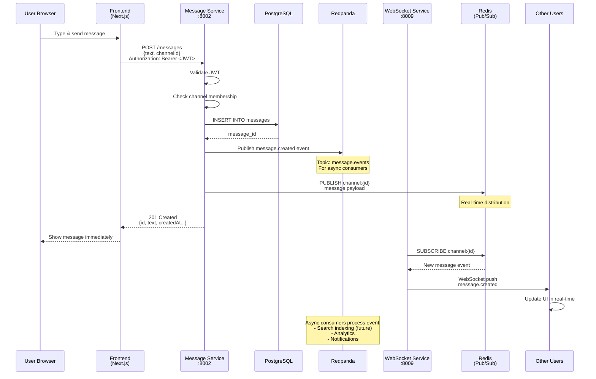
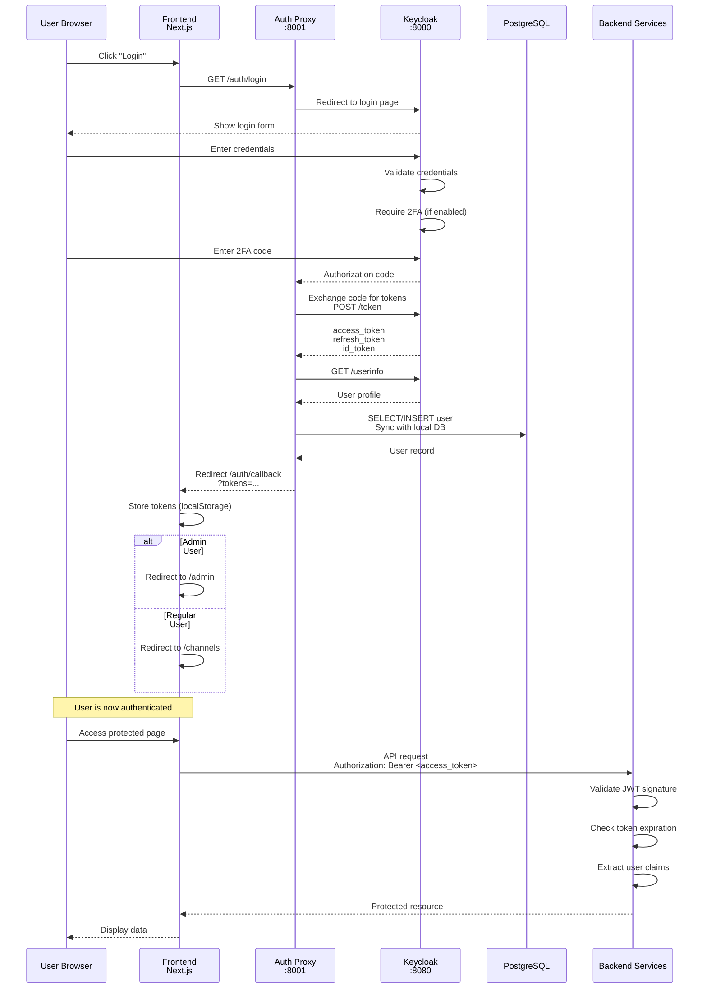
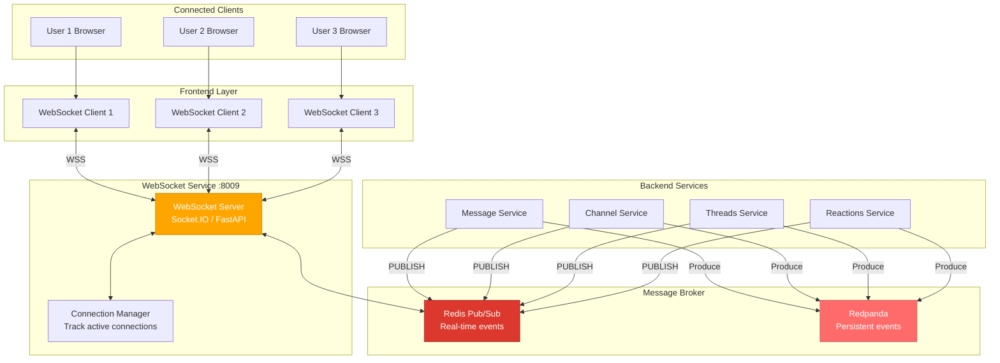
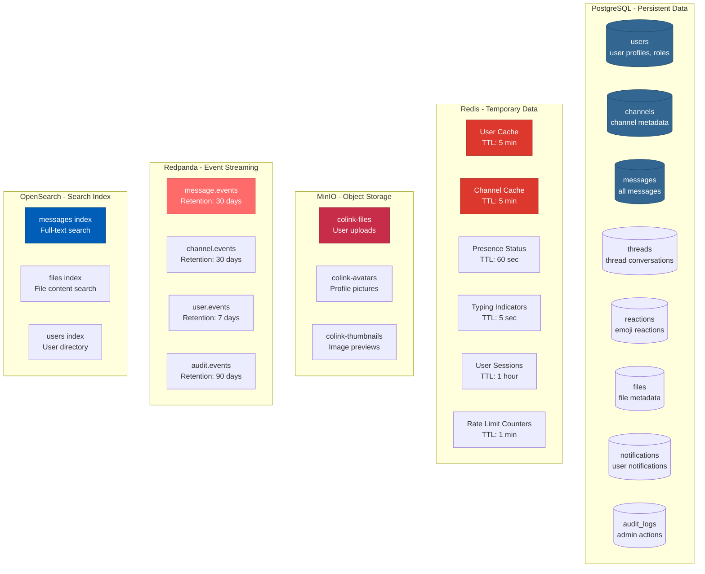
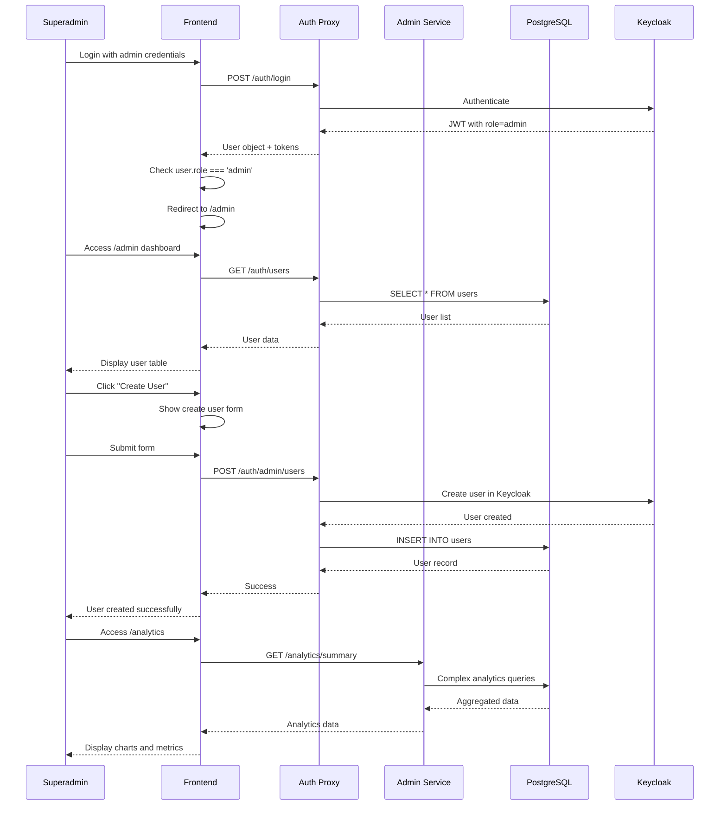
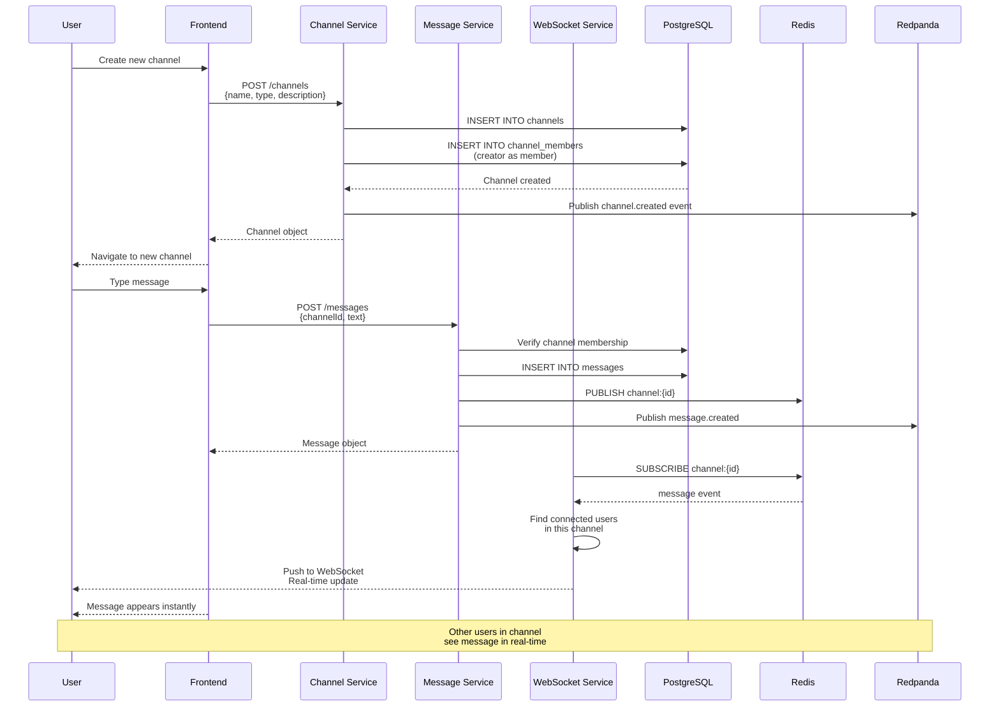

# Colink Architecture Diagrams

This document contains comprehensive architecture diagrams for the Colink Slack Clone project.

---

## 1. System Architecture Overview

High-level view showing all major components and their interactions.

```mermaid
graph TB
    subgraph "Client Layer"
        Browser[Web Browser<br/>Next.js 16 Frontend]
    end

    subgraph "Application Layer"
        Frontend[Frontend Service<br/>:3000<br/>Next.js, React, TypeScript]

        subgraph "Backend Services"
            AuthProxy[Auth Proxy<br/>:8001<br/>Authentication & Users]
            Message[Message Service<br/>:8002<br/>Messages & Analytics]
            Channel[Channel Service<br/>:8003<br/>Channels & Membership]
            Threads[Threads Service<br/>:8005<br/>Thread Conversations]
            Reactions[Reactions Service<br/>:8006<br/>Emoji Reactions]
            Files[Files Service<br/>:8007<br/>File Management]
            Notifications[Notifications Service<br/>:8008<br/>User Notifications]
            WebSocket[WebSocket Service<br/>:8009<br/>Real-time Events]
            Admin[Admin Service<br/>:8010<br/>User Management]
        end
    end

    subgraph "Data Layer"
        PostgreSQL[(PostgreSQL<br/>:5432<br/>Primary Database)]
        Redis[(Redis<br/>:6379<br/>Cache & Sessions)]
        Kafka[(Redpanda/Kafka<br/>:9092<br/>Event Streaming)]
        MinIO[(MinIO<br/>:9000<br/>Object Storage)]
        OpenSearch[(OpenSearch<br/>:9200<br/>Full-text Search)]
    end

    subgraph "Infrastructure"
        Keycloak[Keycloak<br/>:8080<br/>Identity Provider]
        Prometheus[Prometheus<br/>:9090<br/>Metrics]
        Grafana[Grafana<br/>:3001<br/>Dashboards]
    end

    Browser --> Frontend
    Frontend --> AuthProxy
    Frontend --> Message
    Frontend --> Channel
    Frontend --> Threads
    Frontend --> Reactions
    Frontend --> Files
    Frontend --> Notifications
    Frontend --> WebSocket
    Frontend --> Admin

    AuthProxy --> Keycloak
    AuthProxy --> PostgreSQL
    Message --> PostgreSQL
    Message --> Kafka
    Channel --> PostgreSQL
    Channel --> Kafka
    Threads --> PostgreSQL
    Reactions --> PostgreSQL
    Files --> MinIO
    Files --> PostgreSQL
    Notifications --> PostgreSQL
    WebSocket --> Redis
    WebSocket --> Kafka
    Admin --> PostgreSQL

    Message --> Redis
    Channel --> Redis
    AuthProxy --> Redis

    Message --> Prometheus
    Channel --> Prometheus
    WebSocket --> Prometheus

    Grafana --> Prometheus

    OpenSearch -.->|Future| Message

    style Frontend fill:#61DAFB,stroke:#20232A,color:#000
    style AuthProxy fill:#009688,stroke:#00695C,color:#fff
    style Message fill:#009688,stroke:#00695C,color:#fff
    style Channel fill:#009688,stroke:#00695C,color:#fff
    style Threads fill:#009688,stroke:#00695C,color:#fff
    style Reactions fill:#009688,stroke:#00695C,color:#fff
    style Files fill:#009688,stroke:#00695C,color:#fff
    style Notifications fill:#009688,stroke:#00695C,color:#fff
    style WebSocket fill:#009688,stroke:#00695C,color:#fff
    style Admin fill:#009688,stroke:#00695C,color:#fff
    style PostgreSQL fill:#336791,stroke:#22496B,color:#fff
    style Redis fill:#DC382D,stroke:#A02B22,color:#fff
    style Kafka fill:#FF6B6B,stroke:#CC5555,color:#fff
    style MinIO fill:#C72C48,stroke:#9B2239,color:#fff
    style Keycloak fill:#008AAE,stroke:#006685,color:#fff
```

---

## 2. Data Flow: Send Message

Shows the complete flow when a user sends a message in a channel.

---

## 3. Authentication Flow

Shows how users authenticate and access protected resources.

---

## 4. Real-time Message Flow

Shows how WebSocket enables real-time communication.

---

## 5. Data Storage Architecture

Shows how different data types are stored across different storage systems.

---

## 6. Deployment Architecture

Shows how services are deployed in Docker containers.

```mermaid
graph TB
    subgraph "Docker Host"
        subgraph "Application Containers"
            FrontendC[frontend<br/>Node.js + Next.js<br/>Port: 3000]
            AuthC[auth-proxy<br/>Python + FastAPI<br/>Port: 8001]
            MessageC[message<br/>Python + FastAPI<br/>Port: 8002]
            ChannelC[channel<br/>Python + FastAPI<br/>Port: 8003]
            ThreadsC[threads<br/>Python + FastAPI<br/>Port: 8005]
            ReactionsC[reactions<br/>Python + FastAPI<br/>Port: 8006]
            FilesC[files<br/>Python + FastAPI<br/>Port: 8007]
            NotificationsC[notifications<br/>Python + FastAPI<br/>Port: 8008]
            WebSocketC[websocket<br/>Python + FastAPI<br/>Port: 8009]
            AdminC[admin<br/>Python + FastAPI<br/>Port: 8010]
        end

        subgraph "Data Containers"
            PostgreSQLC[postgres<br/>PostgreSQL 16<br/>Port: 5432]
            RedisC[redis<br/>Redis 7<br/>Port: 6379]
            RedpandaC[redpanda<br/>Kafka-compatible<br/>Port: 9092]
            MinIOC[minio<br/>Object Storage<br/>Port: 9000, 9001]
            OpenSearchC[opensearch<br/>Search Engine<br/>Port: 9200, 9600]
        end

        subgraph "Infrastructure Containers"
            KeycloakC[keycloak<br/>Identity Provider<br/>Port: 8080]
            PrometheusC[prometheus<br/>Metrics<br/>Port: 9090]
            GrafanaC[grafana<br/>Dashboards<br/>Port: 3001]
        end

        subgraph "Volumes"
            PostgresVol[postgres_data]
            RedisVol[redis_data]
            MinIOVol[minio_data]
            KeycloakVol[keycloak_data]
            OpenSearchVol[opensearch_data]
        end

        subgraph "Networks"
            AppNet[colink-network<br/>Bridge Network]
        end
    end

    FrontendC -.-> AppNet
    AuthC -.-> AppNet
    MessageC -.-> AppNet
    ChannelC -.-> AppNet
    ThreadsC -.-> AppNet
    ReactionsC -.-> AppNet
    FilesC -.-> AppNet
    NotificationsC -.-> AppNet
    WebSocketC -.-> AppNet
    AdminC -.-> AppNet
    PostgreSQLC -.-> AppNet
    RedisC -.-> AppNet
    RedpandaC -.-> AppNet
    MinIOC -.-> AppNet
    OpenSearchC -.-> AppNet
    KeycloakC -.-> AppNet
    PrometheusC -.-> AppNet
    GrafanaC -.-> AppNet

    PostgreSQLC --> PostgresVol
    RedisC --> RedisVol
    MinIOC --> MinIOVol
    KeycloakC --> KeycloakVol
    OpenSearchC --> OpenSearchVol

    style FrontendC fill:#61DAFB,stroke:#20232A,color:#000
    style AuthC fill:#009688,stroke:#00695C,color:#fff
    style PostgreSQLC fill:#336791,stroke:#22496B,color:#fff
    style RedisC fill:#DC382D,stroke:#A02B22,color:#fff
```

---

## 7. Admin Dashboard Flow

Shows how superadmin accesses and uses the admin dashboard.

---

## 8. Channel Creation & Messaging Flow

Complete flow from creating a channel to sending messages.

---

## Component Details

### Frontend (Next.js 16)
- **Technology**: Next.js 16, React 18, TypeScript
- **Key Features**: SSR, Real-time WebSocket, File uploads, Dark mode
- **State Management**: Zustand for auth and theme
- **Data Fetching**: TanStack Query (React Query)

### Backend Services (Python + FastAPI)
- **Runtime**: Python 3.11
- **Framework**: FastAPI 0.115+
- **ASGI Server**: Uvicorn with workers
- **Database ORM**: SQLAlchemy 2.0
- **Authentication**: JWT validation on all requests

### Data Stores
- **PostgreSQL 16**: ACID-compliant relational database for persistent data
- **Redis 7**: In-memory cache for temporary data and pub/sub
- **Redpanda**: Kafka-compatible event streaming for async processing
- **MinIO**: S3-compatible object storage for files
- **OpenSearch 2.x**: Full-text search engine (infrastructure ready)

### Infrastructure
- **Keycloak 23.x**: OAuth 2.0 / OIDC identity provider
- **Prometheus**: Metrics collection and storage
- **Grafana**: Metrics visualization and dashboards

---

## Key Design Patterns

### 1. Event-Driven Architecture
- Services publish events to Redpanda after state changes
- Other services consume events asynchronously
- Enables loose coupling and scalability

### 2. CQRS (Light)
- Write operations go to PostgreSQL directly
- Read operations use Redis cache when possible
- Analytics queries use optimized read models

### 3. API Gateway Pattern
- Frontend acts as API gateway aggregator
- Backend services have focused, single-responsibility APIs
- No service-to-service synchronous calls (except auth validation)

### 4. Cache-Aside Pattern
- Services check Redis before hitting PostgreSQL
- Cache misses trigger DB query and cache population
- TTL-based cache invalidation

---

## Scalability Considerations

### Horizontal Scaling
- All backend services are stateless and can scale horizontally
- WebSocket service maintains connection state in Redis
- Frontend can be scaled with CDN for static assets

### Database Scaling
- PostgreSQL read replicas for read-heavy workloads
- Connection pooling with PgBouncer
- Future: Table partitioning for messages (by date)

### Cache Optimization
- Redis cluster for high availability
- Separate cache namespaces per service
- Intelligent TTL based on data access patterns

---

**Last Updated**: 2025-12-04
